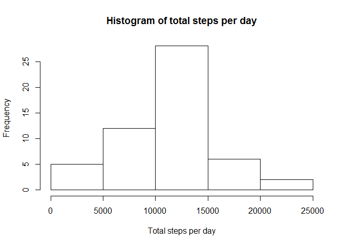
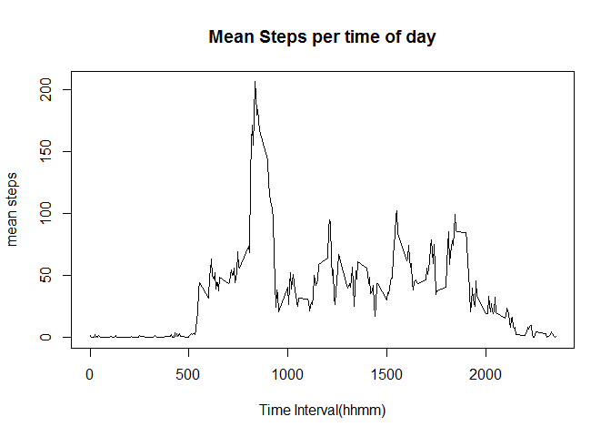
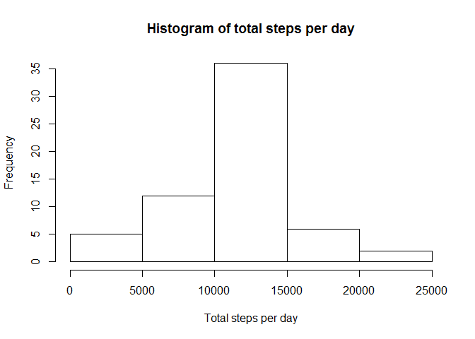
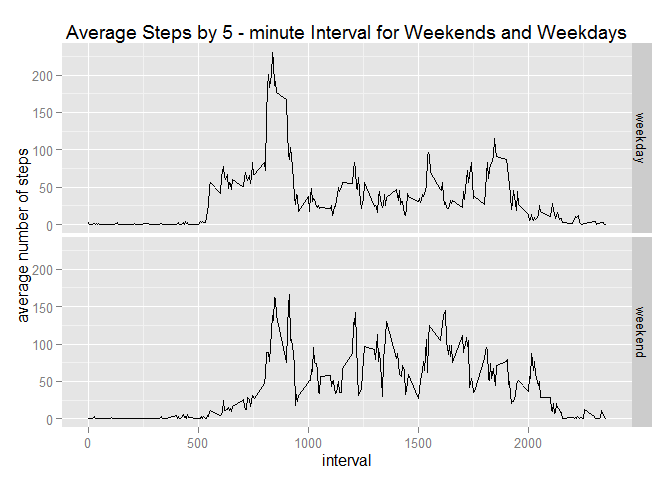

# Reproducible Research: Peer Assessment 1

## Loading and preprocessing the data

```r
require(data.table)
require(ggplot2)
dataFrame <- read.csv(unz("activity.zip", "activity.csv"))
data <- as.data.table(dataFrame)
```

What is mean total number of steps taken per day?

```r
hist(data[,.(sumSteps = sum(steps)), by=date]$sumSteps, xlab="Total steps per day", main = "Histogram of total steps per day")
```

 
-------------
Mean total number of steps per day

```r
data[, .(sum=sum(steps)), by=date][,mean(sum, na.rm=TRUE)]
```

```
## [1] 10766.19
```
  
Median total number of steps per day

```r
data[, .(sum=sum(steps)), by=date][,median(sum, na.rm=TRUE)]
```

```
## [1] 10765
```

## What is the average daily activity pattern?

```r
meanStepsPerInterval<-data[,.(meanSteps = mean(steps, na.rm=TRUE)), by=interval]
plot(meanStepsPerInterval$meanSteps~meanStepsPerInterval$interval, type = "l", xlab="Time Interval(hhmm)", ylab="mean steps", main="Mean Steps per time of day")
```

 
--------------
Maximum activity in interval

```r
interval<-meanStepsPerInterval[which.max(meanSteps),interval]
paste(interval%/%100, interval%%100, sep=":")
```

```
## [1] "8:35"
```
## Imputing missing values
Number of missing values

```r
sum(!complete.cases(data))
```

```
## [1] 2304
```
Percent of missing values

```r
sum(!complete.cases(data)) / nrow(data)
```

```
## [1] 0.1311475
```
13% percent of missing data introduces bias. We will fill the missing values with 5-minute mean values. Impute values are stored in meanStepsInterval. That`s mean value should be casted to int.


```r
setnames(meanStepsPerInterval, "interval", "groupedInterval")
fdata<-copy(data)
summary( fdata[!complete.cases(fdata),steps:=as.integer(meanStepsPerInterval[groupedInterval==interval]$meanSteps)])
```

```
##      steps                date          interval     
##  Min.   :  0.00   2012-10-01:  288   Min.   :   0.0  
##  1st Qu.:  0.00   2012-10-02:  288   1st Qu.: 588.8  
##  Median :  0.00   2012-10-03:  288   Median :1177.5  
##  Mean   : 37.33   2012-10-04:  288   Mean   :1177.5  
##  3rd Qu.: 27.00   2012-10-05:  288   3rd Qu.:1766.2  
##  Max.   :806.00   2012-10-06:  288   Max.   :2355.0  
##                   (Other)   :15840
```
###Analysis of datasets without missing values
What is mean total number of steps taken per day?

```r
hist(fdata[,.(sumSteps = sum(steps)), by=date]$sumSteps, xlab="Total steps per day", main = "Histogram of total steps per day")
```

 
-------------
Mean total number of steps per day

```r
fdata[, .(sum=sum(steps)), by=date][,mean(sum, na.rm=TRUE)]
```

```
## [1] 10749.77
```
Median total number of steps per day

```r
fdata[, .(sum=sum(steps)), by=date][,median(sum, na.rm=TRUE)]
```

```
## [1] 10641
```


The histogram, mean and median values are slightly different from original dataset with NA values. 0.1524977 percent difference make the chosen impute strategy solid.

## Are there differences in activity patterns between weekdays and weekends?
Adding factor variable weekend or weekday.

```r
fdata[,daytype:=ifelse(weekdays(as.Date(date)) %in% c('Saturday','Sunday'), "weekend", "weekday")]
```

```
##        steps       date interval daytype
##     1:     1 2012-10-01        0 weekday
##     2:     0 2012-10-01        5 weekday
##     3:     0 2012-10-01       10 weekday
##     4:     0 2012-10-01       15 weekday
##     5:     0 2012-10-01       20 weekday
##    ---                                  
## 17564:     4 2012-11-30     2335 weekday
## 17565:     3 2012-11-30     2340 weekday
## 17566:     0 2012-11-30     2345 weekday
## 17567:     0 2012-11-30     2350 weekday
## 17568:     1 2012-11-30     2355 weekday
```

```r
fdata[,daytype:=as.factor(daytype)]
```

```
##        steps       date interval daytype
##     1:     1 2012-10-01        0 weekday
##     2:     0 2012-10-01        5 weekday
##     3:     0 2012-10-01       10 weekday
##     4:     0 2012-10-01       15 weekday
##     5:     0 2012-10-01       20 weekday
##    ---                                  
## 17564:     4 2012-11-30     2335 weekday
## 17565:     3 2012-11-30     2340 weekday
## 17566:     0 2012-11-30     2345 weekday
## 17567:     0 2012-11-30     2350 weekday
## 17568:     1 2012-11-30     2355 weekday
```
Calculate mean and plot graph for weekdays and weekends

```r
fMeanSteps<-fdata[,.(meanSteps=mean(steps)), by=.(daytype, interval)]
ggplot(fMeanSteps, aes(interval, meanSteps)) + geom_line() + facet_grid(daytype~.) + ylab("average number of steps") + ggtitle("Average Steps by 5 - minute Interval for Weekends and Weekdays")
```

 
----------
There are signigicant difference between weekend/weekday pattern.
